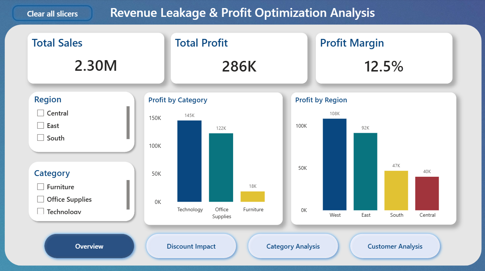
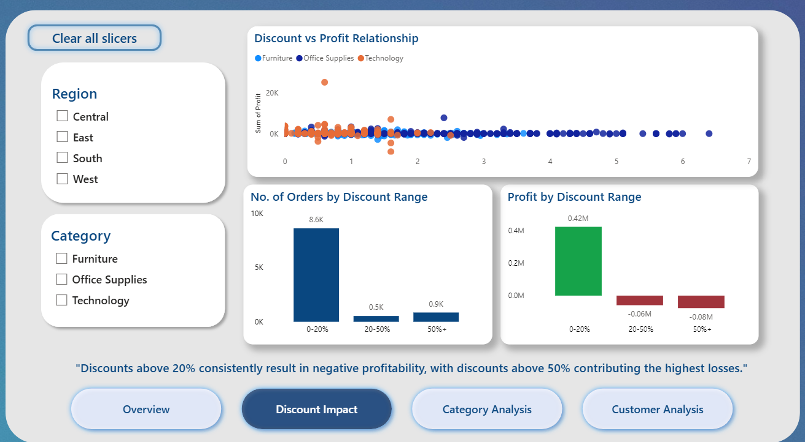
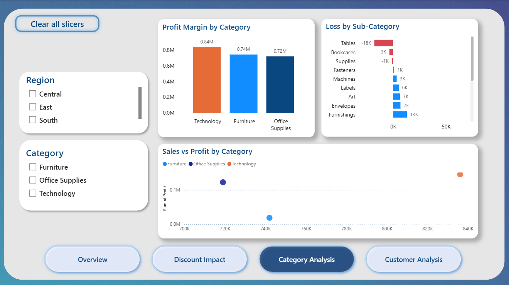
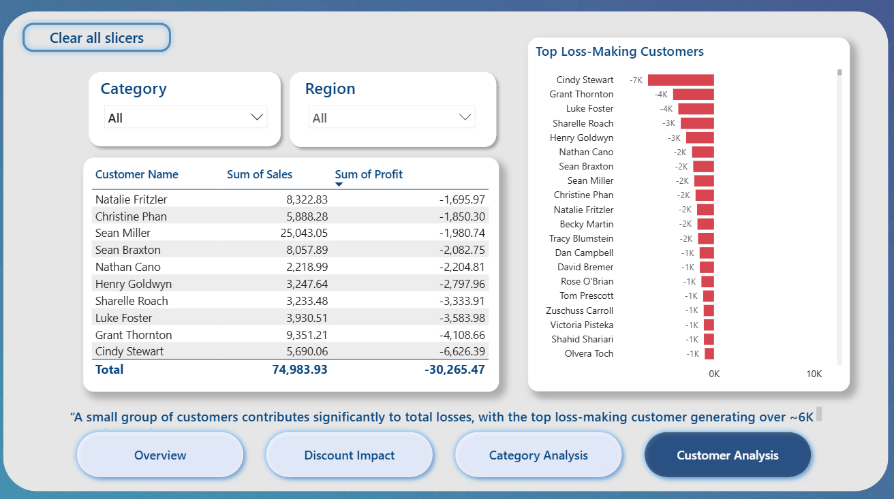

# Revenue Leakage & Profit Optimization Analysis

## Overview
This project analyzes retail sales data to identify key drivers of revenue leakage and profitability issues.

## Tools Used
- Power BI
- SQL
- Excel

## Key Insights
- Discounts above 20% consistently result in losses
- Discounts above 50% contribute the highest revenue loss (~75K)
- Furniture category is the highest loss-making segment (~60K)
- A small group of customers contributes significantly to total losses

## Dashboard Features
- KPI overview (Sales, Profit, Profit Margin)
- Discount impact analysis
- Category and sub-category performance
- Customer-level loss analysis

## Dashboard Preview

### Overview

### Discount Impact

### Category Analysis

### Customer Analysis

## Files
- Power BI Dashboard (.pbix)
- Dashboard Screenshots
